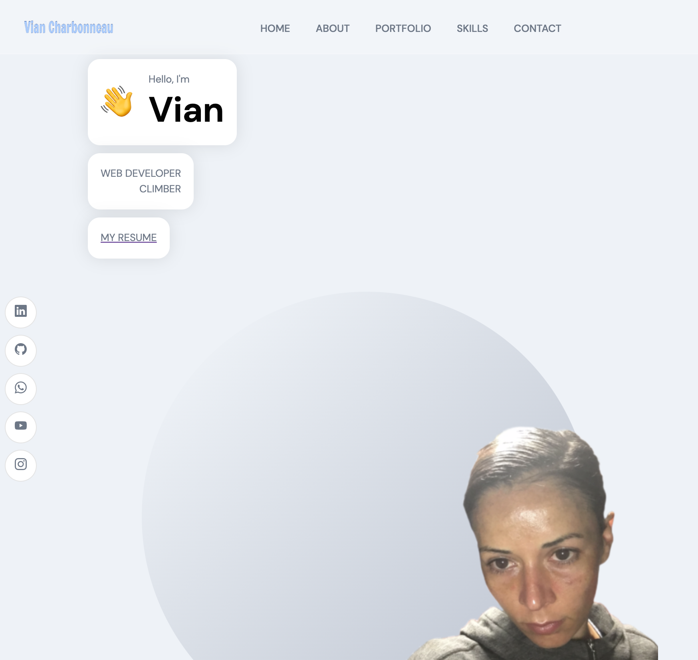

# react_portfolio

This app is a professional personal website. It uses React, NodeJS, framer-motioin, axios, eslint and other technologies. It includes links to projects, repos, social media, resume and more.

Here is the gitHub repo link:
https://github.com/vianvianc/react_portfolio

Here is the deployed link:
https://vianvianc.github.io/react_portfolio/

